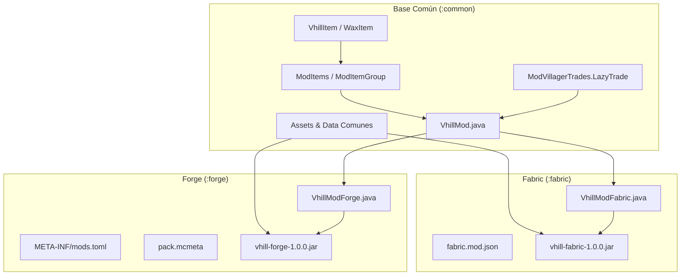
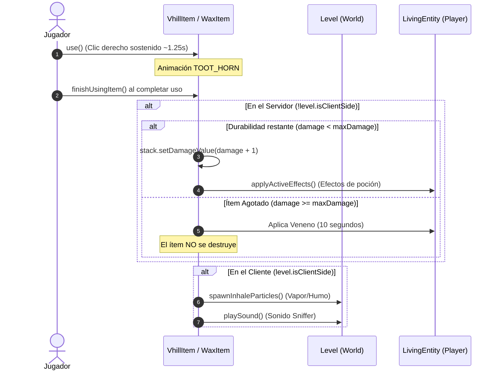

# 🏛️ Arquitectura del Proyecto Vhill Mod

Este documento detalla los principios de diseño, la estructura multi-módulo, el ciclo de vida de registros y los patrones técnicos empleados en el desarrollo de **Vhill Mod** para **Minecraft 1.20.1** usando **Architectury Loom**.

---

## 1. Visión General Multi-Loader

El proyecto utiliza **Architectury** para mantener una sola base de código común compartida entre **Fabric** y **Forge**, eliminando la duplicación de lógica y garantizando paridad absoluta de características en ambas plataformas.



---

## 2. Desglose de Módulos

### 2.1 Módulo Común (`:common`)
- **Propósito**: Contiene el 95% del código del mod, así como todos los recursos estáticos (texturas, modelos de ítems, recetas de crafteo, tablas de traducción de idiomas y definiciones de paquetes).
- **Mapeos**: Mappings oficiales de Mojang (`loom.officialMojangMappings()`).
- **Dependencias**: `architectury` (agnóstico) y `minecraft`.
- **Regla Estricta**: No debe importar ninguna clase perteneciente a paquetes exclusivos de cliente (`net.minecraft.client.*`) ni clases específicas de una plataforma (`net.fabricmc.*`, `net.minecraftforge.*`).

### 2.2 Módulo Fabric (`:fabric`)
- **Propósito**: Punto de entrada para Fabric Loader.
- **Entrypoint**: [`net.vhill.fabric.VhillModFabric`](file:///home/enrique/Documents/mod-mc/fabric/src/main/java/net/vhill/fabric/VhillModFabric.java), que implementa `net.fabricmc.api.ModInitializer` e invoca `VhillMod.init()`.
- **Empaquetado**: Utiliza el plugin Gradle `shadow` para empaquetar las clases y recursos transformados del módulo común en el artefacto final `vhill-fabric-1.0.0.jar`.

### 2.3 Módulo Forge (`:forge`)
- **Propósito**: Punto de entrada para Minecraft Forge.
- **Entrypoint**: [`net.vhill.forge.VhillModForge`](file:///home/enrique/Documents/mod-mc/forge/src/main/java/net/vhill/forge/VhillModForge.java), anotado con `@Mod(VhillMod.MOD_ID)`. Utiliza `EventBspFactory.createEventLoop()` de Architectury para registrar los buses de eventos de Forge e invoca `VhillMod.init()`.
- **Requisito de Recursos en Forge**: Forge requiere un archivo `pack.mcmeta` con `pack_format: 15` para reconocer el directorio de recursos del mod como un `ResourcePackInfo` válido.

---

## 3. Patrones de Diseño y Componentes Clave

### 3.1 Registro de Ítems (`DeferredRegister<Item>`)
En lugar de llamar directamente a `Registry.register` (exclusivo de Fabric) o `@SubscribeEvent RegisterEvent` (exclusivo de Forge), se utiliza la abstracción de Architectury:

```java
public class ModItems {
    public static final DeferredRegister<Item> ITEMS = DeferredRegister.create(VhillMod.MOD_ID, Registries.ITEM);

    public static final RegistrySupplier<VhillItem> VHILL_FRESA_3K = registerVhill("vhill_fresa_3k", VhillCategory.K3, VhillFlavor.FRESA);
    
    public static void register() {
        ITEMS.register();
    }
}
```
`RegistrySupplier<T>` actúa como un contenedor perezoso (*lazy holder*), permitiendo referenciar el ítem de forma segura antes de que Minecraft termine su fase de arranque.

---

### 3.2 Registro Seguro de Comercios de Aldeanos (`LazyTrade`)
#### Problema Resuelto:
En Forge, el constructor de la clase `@Mod` se ejecuta **antes** de que los ítems sean añadidos al registro interno del juego. La clase `SimpleTrade` estándar de Architectury evalúa inmediatamente los `ItemStack` pasados al constructor, lo que provocaba `NullPointerException: Registry Object not present: vhill:vhill_fresa_3k`.

#### Solución Implementada:
Se implementó un registro perezoso mediante un `record` que implementa `VillagerTrades.ItemListing`:

```java
public record LazyTrade(
    ItemStack price,
    Supplier<? extends Item> saleItem,
    int maxTrades,
    int xp,
    float priceMultiplier
) implements VillagerTrades.ItemListing {

    @Override
    public MerchantOffer getOffer(Entity entity, RandomSource random) {
        return new MerchantOffer(price, new ItemStack(saleItem.get()), maxTrades, xp, priceMultiplier);
    }
}
```
Con esto, `saleItem.get()` solo se invoca en tiempo de juego cuando el aldeano interactúa con un jugador, garantizando que todos los ítems ya están 100% registrados.

---

### 3.3 Mecánica de Uso, Desgaste y Penalización

El ciclo de inhalación de `VhillItem` se gestiona en `finishUsingItem`:



---

### 3.4 Pestaña Creativa (`ModItemGroup`)
Centralizada usando:
- `DeferredRegister<CreativeModeTab>`
- `CreativeTabRegistry.create()`
- Los ítems se asocian a la pestaña mediante la propiedad `properties.arch$tab(ModItemGroup.VHILL_TAB)`.

---

## 4. Convenciones de Mapeos y Nomenclatura

| Concepto | Yarn (Antiguo Fabric) | Mojang Official (Actual) |
| :--- | :--- | :--- |
| Configuración de Ítem | `FabricItemSettings` | `Item.Properties` |
| Efecto de Estado | `StatusEffectInstance` | `MobEffectInstance` |
| Registro de Efectos | `StatusEffects.REGENERATION` | `MobEffects.REGENERATION` |
| Mano de Interacción | `Hand.MAIN_HAND` | `InteractionHand.MAIN_HAND` |
| Lado del Mundo | `world.isClient()` | `level.isClientSide()` |
| Tooltip | `appendTooltip(...)` | `appendHoverText(...)` |
